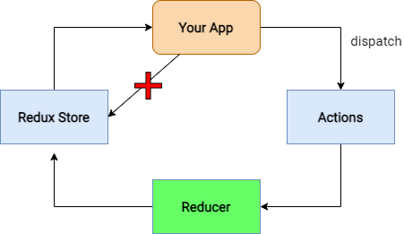

# ejercicioreact20260901_1

## CORS

JS ---> Servidor 

* Se lee el header de la petición HTTP y se valida si el origen de la petición es permitido.
* Si el origen es permitido, se envía la respuesta con el header `Access-Control-Allow-Origin` correspondiente.

## refs

Usualente no queremos usar Refs en React, pero hay casos donde es necesario. Por ejemplo, cuando necesitamos acceder a un elemento del DOM directamente, como un input o un canvas.

Un ejemplo de uso de Ref en un input:

```jsx
import React, { useRef } from 'react';
function MyComponent() {
  const inputRef = useRef<HTMLInputElement | null>(null);

  const handleClick = () => {
    inputRef.current.focus();
  };

  return (
    <div>
      <input ref={inputRef} type="text" />
      <button onClick={handleClick}>Focus Input</button>
    </div>
  );
}
```

### React hooks

Ejemplo de hooks

```jsx
import React, { useState } from 'react';

const [count, setCount] = useState(0);
```

## Redux

Redux es una librería para el manejo del estado de la aplicación en React. Permite centralizar el estado en un único store y facilita la comunicación entre componentes.

* React-Redux: Es la integración oficial de Redux con React, que proporciona componentes y hooks para conectar el store de Redux con los componentes de React.
* Redux Toolkit: (RTK) Es una herramienta que simplifica la configuración y el uso de Redux, proporcionando utilidades para crear slices, reducers y acciones de manera más sencilla.




### instalacion

npm install @reduxjs/toolkit react-redux react-router-dom


### Pasos

* Instalar Redux Toolkit y React-Redux.
* Crear un store de Redux (store.ts)
* Modificar root.tsx para envolver la aplicación con el Provider de Redux.

```tsx
export default function App() {
  return (
    <Provider store={store}>
      <Outlet />
    </Provider>
  );
}
```

* Crear slices para manejar el estado de la aplicación (counterSlice.ts, textoSlice.ts)
* Agregar los reducers de los slices al store.
* Para poder ocuparlo

Si se quiere usar el store en un componente, se puede usar el hook `useAppSelector` para leer el estado y `useAppDispatch` para despachar acciones.

```tsx
import React from 'react';
import { useAppSelector, useAppDispatch } from './store';
import { increment } from './slice/counterSlice';

export default function Counter() {
  const count = useAppSelector((state) => state.counter.value); // leer
  const dispatch = useAppDispatch(); // despachar acciones

  return (
    <div>
      <p>{count}</p>
      <button onClick={() => dispatch(increment())}>Increment</button>
    </div>
  );
}
```

## Ejercicio

* Crear un slice llamado numeroSlice que tenga un estado inicial con un valor numérico y una acción para incrementar ese valor.

